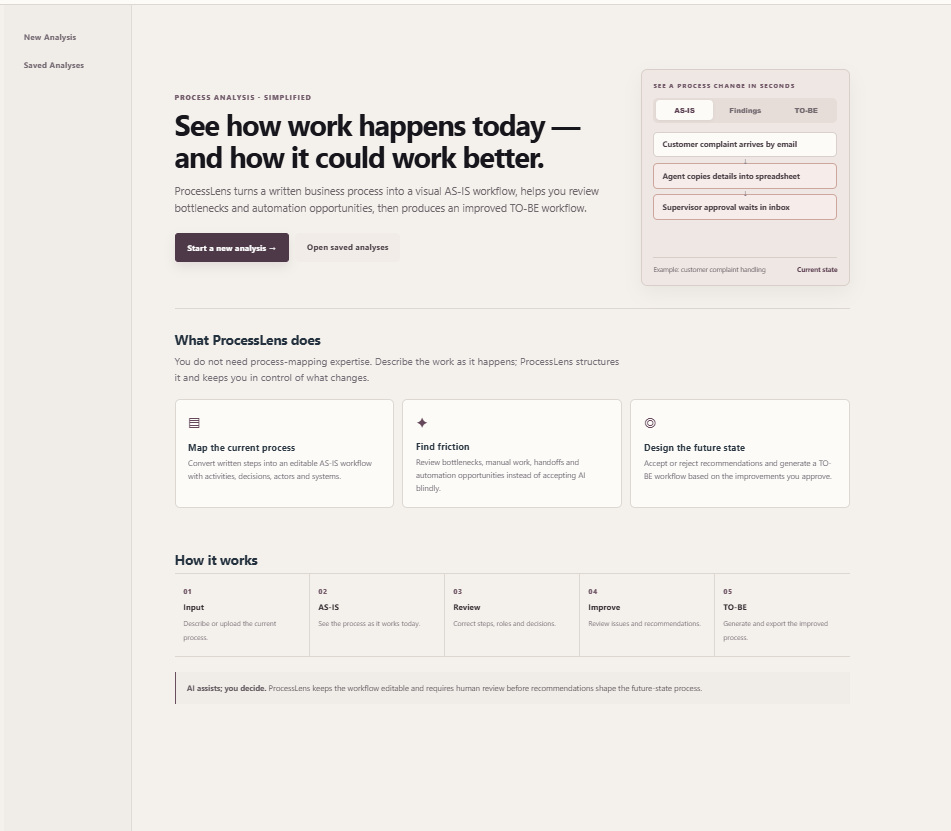
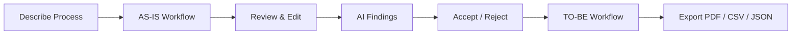

# ProcessLens

ProcessLens is a workflow-analysis web application for turning a written business process into an editable **AS-IS** workflow, reviewing bottlenecks and automation opportunities, and generating a human-approved **TO-BE** workflow.

`Input → AS-IS → Review → Improve → TO-BE → Export`

## Application preview



## Workflow at a glance



## What a user can do

- Start from a plain-language process description or TXT/Markdown/CSV/DOCX input.
- Generate a structured workflow graph with steps, decisions, actors and systems.
- Review, reorder, add or remove AS-IS steps before accepting AI conclusions.
- Review bottlenecks and improvement recommendations individually.
- Accept/reject recommendations before they can influence the TO-BE workflow.
- Export the completed analysis as PDF, CSV or JSON.
- Reopen saved analyses.

The public landing page explains AS-IS/TO-BE concepts and the five-stage workflow before the user starts an analysis.

## AI and fallback behavior

Provider order:

1. Gemini — primary online provider.
2. Groq — optional backup provider.
3. Local analysis engine — always available fallback.

ProcessLens renders workflow diagrams itself from structured graph data. AI providers supply analysis/graph structure; they do not generate diagram images.

If online AI is unavailable, ProcessLens continues with the local engine. Public users see a concise fallback message; technical provider errors are hidden unless debug mode is explicitly enabled.

## Run locally on Windows

Double-click:

```text
START_PROCESSLENS.bat
```

The `.bat` file is only a local-development launcher. Website visitors never run it.

## Deploy to Vercel

The repository includes a root `app.py` FastAPI entrypoint.

1. Push this repository to GitHub.
2. Import the repository into Vercel.
3. Add `GEMINI_API_KEY` in Vercel Environment Variables.
4. Optionally add `GROQ_API_KEY`.
5. Connect a **Private Vercel Blob** store so `BLOB_READ_WRITE_TOKEN` is available.
6. Deploy and verify `/health`.

Detailed instructions: [docs/VERCEL.md](docs/VERCEL.md)

## Health check

```text
/health
```

Reports the application version, configured AI providers, and persistence status.

## Repository structure

```text
app.py                    Vercel FastAPI entrypoint
app/
  analyzer.py             Gemini/Groq/local analysis
  models.py               Process data structures
  report.py               PDF / CSV / JSON exports
  selfcheck.py            Local startup checks
  server.py               UI, local server, validation and rendering
  store.py                Local JSON persistence
  vercel_store.py         Private Vercel Blob persistence
docs/
  DEPLOYMENT.md
  VERCEL.md
START_PROCESSLENS.bat      Local Windows launcher only
requirements.txt          Deployment dependencies
.python-version            Python version for deployment
.env.example               Environment variable template
```

## Security and deployment notes

- Never commit API keys or `processlens_data.json`.
- Vercel keeps provider keys server-side; public pages do not expose key inputs.
- Public deployment uses Private Vercel Blob rather than the temporary function filesystem.
- Each browser gets a random HttpOnly identifier to isolate its saved-analysis namespace. V1 has no account authentication, so this is demo isolation rather than account-level security.
- Keep provider billing disabled if you want to guarantee no paid AI usage.
- `PROCESSLENS_DEBUG_ERRORS=1` exposes technical provider errors and should not be enabled in production.

## V1 scope

V1 is intentionally limited to:

`Input → AS-IS → Review → Improvements → TO-BE/Export`

It does **not** include accounts, billing, teams, RAG, workflow execution, background workers, n8n execution, or mobile apps.
